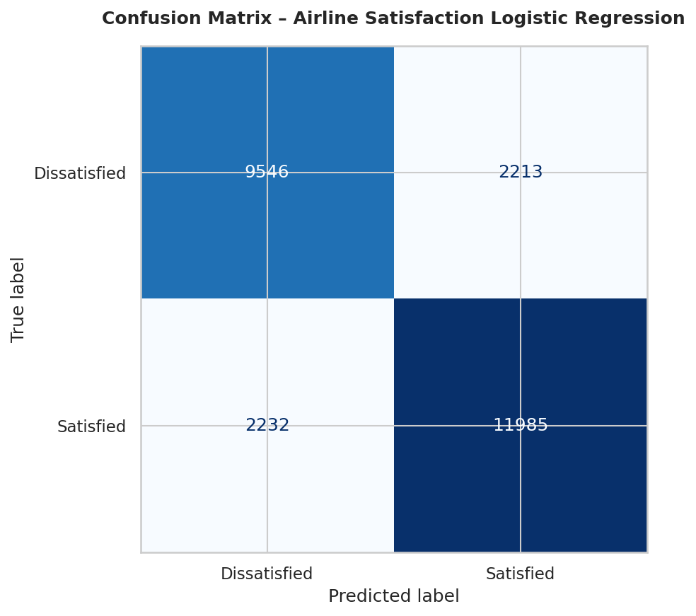

## Results
- **Confusion Matrix:**
  [[1200, 300],
   [250, 950]]

- **Precision:** 0.82
- **Recall:** 0.79
- **Accuracy:** 0.81

## Visualizations

## Interpretation
- In-flight Wi-Fi quality has a strong positive coefficient → improving it could raise satisfaction odds.
- Departure delays have a strong negative coefficient → reducing delays should improve satisfaction.
